# 蓝桥杯备赛日志

## 零、前置知识

​	基础不牢，地动山摇。这里简单补充一下一些可能需要的前置知识。

 ### 1、运算

 #### 算术运算符

​	很简单，不叨扰。

| 运输符 |           运算           |
| :----: | :----------------------: |
|   +    |            加            |
|   -    |            减            |
|   *    |            乘            |
|   /    |            除            |
|   %    | 取模运算符，整除后的余数 |
|   ++   | 自增运算符，整数值增加 1 |
|   --   | 自减运算符，整数值减少 1 |

​	务必熟记他们的作用（尤其是自增自减），在一些数学处理中会有很大作用。

  ##### 1. 除法 (`/`) 与 取模 (`%`)：不仅是算术

这两个符号在不同数据类型中，表现大不相同。

- **整数除法陷阱**：在 C 中，`5 / 2` 的结果是 `2` 而不是 `2.5`（小数部分被直接舍弃）。如果你想要精确结果，至少得有一个数是浮点数，比如 `5 / 2.0`。
- **取模妙用**：
  - **判断奇偶**：`n % 2 == 0` 为偶数。
  - **周期性循环**：比如在一个长度为 $N$ 的数组中循环索引，可以使用 `index = (index + 1) % N`，这样索引永远不会越界。
  - **单位换算**：`65秒 % 60` 得到 `5秒`。

##### 2. 自增 (`++`) 与 自减 (`--`)：前后位置

这是最容易写出 Bug 的地方。**位置决定了赋值的时机。**

| **表达式**         | **描述**           | **效果**                |
| ------------------ | ------------------ | ----------------------- |
| **`i++` (后自增)** | 先参与运算，后加 1 | `int a = i; i = i + 1;` |
| **`++i` (前自增)** | 先加 1，后参与运算 | `i = i + 1; int a = i;` |

比如：

```c
int i = 1;
int a = ++i; // i 先变成 2，再赋值给 a。结果：a=2, i=2
int j = 1;
int b = j++; // j 先把 1 赋值给 b，然后再变成 2。结果：b=1, j=2
```

#### 关系运算符

假设变量 **A** 的值为 10，变量 **B** 的值为 20，则：

|运算符  |描述 |实例|
| ---- | ------------------------------------------------------------ | --------------- |
| ==   | 检查两个操作数的值是否相等，如果相等则条件为真。             | (A == B) 为假。 |
| !=   | 检查两个操作数的值是否相等，如果不相等则条件为真。           | (A != B) 为真。 |
| >    | 检查左操作数的值是否大于右操作数的值，如果是则条件为真。     | (A > B) 为假。  |
| <    | 检查左操作数的值是否小于右操作数的值，如果是则条件为真。     | (A < B) 为真。  |
| >=   | 检查左操作数的值是否大于或等于右操作数的值，如果是则条件为真。 | (A >= B) 为假。 |
| <=   | 检查左操作数的值是否小于或等于右操作数的值，如果是则条件为真。 | (A <= B) 为真。 |

​	主要运用在条件判断中。

#### 逻辑运算符

假设变量 **A** 的值为 1，变量 **B** 的值为 0，则：

| 运算符 | 描述                                                         | 实例              |
| :----- | :----------------------------------------------------------- | :---------------- |
| &&     | 称为逻辑与运算符。如果两个操作数都非零，则条件为真。         | (A && B) 为假。   |
| \|\|   | 称为逻辑或运算符。如果两个操作数中有任意一个非零，则条件为真。 | (A \|\| B) 为真。 |
| !      | 称为逻辑非运算符。用来逆转操作数的逻辑状态。如果条件为真则逻辑非运算符将使其为假。 | !(A && B) 为真。  |

​	当下很多人学的第一门编程语言是Python，这三者在Python中便是**and**，**or**，**not**。也多用于条件判断。

​	逻辑运算符处理的是**真（True）与假（False）**。在 C 语言中：

- **0** 表示假。

- **非 0**（如 1, -1, 100）全都被视为真。

  故我们需要将其与下面的位运算符加以区分，不能把 `&` 和 `&&` 搞混，这是非常致命的。

#### 位运算符

​	位运算符作用于位，并逐位执行操作。&、 | 和 ^ 的真值表如下所示：

| p    | q    | p & q | p \| q | p ^ q |
| :--- | :--- | :---- | :----- | :---- |
| 0    | 0    | 0     | 0      | 0     |
| 0    | 1    | 0     | 1      | 1     |
| 1    | 1    | 1     | 1      | 0     |
| 1    | 0    | 0     | 1      | 1     |

​	**&与，只有二者都为1时才得1；|或，二者只要有1，就得1；^异或，二者不同得1，相同得0。**

假设如果 A = 60，且 B = 13，现在以二进制格式表示，它们如下所示：

A = 0011 1100

B = 0000 1101

\-----------------

A&B = 0000 1100

A|B = 0011 1101

A^B = 0011 0001

~A = 1100 0011

假设变量 **A** 的值为 60，变量 **B** 的值为 13，则：

| 运算符 | 描述                                                         | 实例                                                         |
| :----- | :----------------------------------------------------------- | :----------------------------------------------------------- |
| &      | 对两个操作数的每一位执行逻辑与操作，如果两个相应的位都为 1，则结果为 1，否则为 0。按位与操作，按二进制位进行"与"运算。运算规则：`0&0=0;    0&1=0;     1&0=0;      1&1=1;` | (A & B) 将得到 12，即为 0000 1100                            |
| \|     | 对两个操作数的每一位执行逻辑或操作，如果两个相应的位都为 0，则结果为 0，否则为 1。按位或运算符，按二进制位进行"或"运算。运算规则：`0|0=0;    0|1=1;    1|0=1;     1|1=1;` | (A \| B) 将得到 61，即为 0011 1101                           |
| ^      | 对两个操作数的每一位执行逻辑异或操作，如果两个相应的位值相同，则结果为 0，否则为 1。异或运算符，按二进制位进行"异或"运算。运算规则：`0^0=0;    0^1=1;    1^0=1;   1^1=0;` | (A ^ B) 将得到 49，即为 0011 0001                            |
| ~      | 对操作数的每一位执行逻辑取反操作，即将每一位的 0 变为 1，1 变为 0。取反运算符，按二进制位进行"取反"运算。运算规则：`~1=-2;    ~0=-1;` | (~A ) 将得到 -61，即为 1100 0011，一个有符号二进制数的补码形式。 |
| <<     | 将操作数的所有位向左移动指定的位数。左移 n 位相当于乘以 2 的 n 次方。二进制左移运算符。将一个运算对象的各二进制位全部左移若干位（左边的二进制位丢弃，右边补0）。 | A << 2 将得到 240，即为 1111 0000                            |
| >>     | 将操作数的所有位向右移动指定的位数。右移n位相当于除以 2 的 n 次方。二进制右移运算符。将一个数的各二进制位全部右移若干位，正数左补 0，负数左补 1，右边丢弃。 | A >> 2 将得到 15，即为 0000 1111                             |

------

**测试题**： 假设 `a = 1` (二进制 `01`), `b = 2` (二进制 `10`)

- `a && b` 的结果是 **1** (真)
- `a & b` 的结果是 **0** (二进制 `00`)

------

#### 赋值运算符

| 运算符 | 描述                                                         | 实例                            |
| :----- | :----------------------------------------------------------- | :------------------------------ |
| =      | 简单的赋值运算符，把右边操作数的值赋给左边操作数             | C = A + B 将把 A + B 的值赋给 C |
| +=     | 加且赋值运算符，把右边操作数加上左边操作数的结果赋值给左边操作数 | C += A 相当于 C = C + A         |
| -=     | 减且赋值运算符，把左边操作数减去右边操作数的结果赋值给左边操作数 | C -= A 相当于 C = C - A         |
| *=     | 乘且赋值运算符，把右边操作数乘以左边操作数的结果赋值给左边操作数 | C *= A 相当于 C = C * A         |
| /=     | 除且赋值运算符，把左边操作数除以右边操作数的结果赋值给左边操作数 | C /= A 相当于 C = C / A         |
| %=     | 求模且赋值运算符，求两个操作数的模赋值给左边操作数           | C %= A 相当于 C = C % A         |
| <<=    | 左移且赋值运算符                                             | C <<= 2 等同于 C = C << 2       |
| >>=    | 右移且赋值运算符                                             | C >>= 2 等同于 C = C >> 2       |
| &=     | 按位与且赋值运算符                                           | C &= 2 等同于 C = C & 2         |
| ^=     | 按位异或且赋值运算符                                         | C ^= 2 等同于 C = C ^ 2         |
| \|=    | 按位或且赋值运算符                                           | C \|= 2 等同于 C = C \| 2       |

### 2、状态机

​	状态机是一种将复杂逻辑可视化和结构化的思维模型。它通过**状态**、**事件**和**转移**这三个核心要素，清晰地定义了事物的行为规则。在处理任何包含明确阶段和规则的生命周期问题时，状态机都是一个非常值得考虑的解决方案。

​	

​	LCD显示屏在切换界面时，常使用状态机来管理不同的显示内容。下面以一个简单的例子说明：假设我们需要显示两个界面（界面1和界面2），通过一个状态变量来控制当前显示哪个界面。

首先，定义一个枚举类型来表示所有可能的界面状态：

```c
typedef enum {
    SCREEN_1,   // 界面1
    SCREEN_2    // 界面2
} ScreenState;

ScreenState State = SCREEN_1;  // 初始状态为界面1
```

循环中，根据当前状态调用对应的显示函数，并检测按键按下来改变状态：

```c
while (1) {
    switch (State) {
        case SCREEN_1:
            displayScreen1();   // 显示界面1的内容
            if (keydown()) {  // 检测到切换按键
                currentState = SCREEN_2;  // 切换到界面2
            }
            break;
        case SCREEN_2:
            displayScreen2();   // 显示界面2的内容
            if (keydown()) {
                currentState = SCREEN_1;  // 切换回界面1
            }
            break;
    }
}
```

### 3、一些简单算法

我们需要了解一点简单的算法知识来应对题目，帮助我们完成任务。

```c
//最大值
s16 max(s16* n, u8 len) {
    s16 max_val = n[0]; 
    for (u8 i = 1; i < len; i++) {
        if (n[i] > max_val) {
            max_val = n[i];
        }
    }
    return max_val;
}
```

```c
//最小值
s16 min(s16* n, u8 len) {
    s16 min = n[0]; 
    for (u8 i = 1; i < len; i++) {
        if (n[i] < min) {
            min = n[i];
        }
    }
    return min;
}
```

```c
//绝对值
#define ABS(x) ((x) < 0 ? -(x) : (x))
```


## 一，主观题

### 引言：

​	不由的说，这是第二次踏上备赛历程，一年了，很多变化也不由让人感叹，仍然屁话不多说了，干吧。

​																			2026年2月19日 日子人

### 0.总说

​	本文档基于蚂蚁工厂的蓝桥杯嵌入式课程整理，其大致思路为（CodeMx只作为配置工具，将其生成的代码细化拆分再合并为新工程），孰优孰劣，还很难说。如今在此基础上进行一定的改良，争取缩短硬件配置的时间。

​	本文档的主要目的是记录一些代码思路和配置信息，比赛确是学习的好方式，期间也多有收获，仅此作为记录。

### 1.最初工程的建立（系统时钟和其他配置）

​	区别于原教程二次配置方式，我们这次只用CodeMX配置一个工程作为最终工程。故我们需要遵守CodeMX编写的注释规则。

​	首先是时钟，我们高速时钟选择外部晶振，这个步骤会使我们使能我们的GPIOF。


​	**外部晶振的大小是24MHZ，记住这一点。**我们需要在时钟树界面配置使**系统主频达到80MHZ**。


​	选择外部时钟，24MHZ，3分配 *20 /2，选择锁相环控制，得到系统主频80MHZ。也可以选择外部时钟，锁相环控制后，直接输入80MHZ，软件会自己计算分配数值。

​	然后更改Project Mananger界面，打开Project侧栏。只更改Project Settings。文件路径建议全英文，这样不容易出问题。


而在Code Generator中我们选定生成独立的.c.h文件。


​	此时，我们的工程文档的基础已经打好，下面就可以开始进行我们外设的配置。与上次不同，这一次我们直接在生成的文档里进行编写。

### 2.三大金刚——LED KEY LCD外设

​	LED KEY LCD这三兄弟是比赛必出，我们把他们放到一起说。有关GPIO的底层原理我们这里不再赘述。这里讲一下配置的要点和代码的思路。

#### ①LED

​	简单看一下操作原理。


​	GPIO口与LED小灯的连接经过一个**锁存器**，锁存器由PD2所控制，PD2输出高电平时，PC8-15才能去控制LED，而PD2输出低电平时，我们的小灯会在原来的状态被锁住……亮的保持亮，暗的继续暗。

​	小灯的一端是高电平，故我们将**GPIO置低**小灯会亮。而且我们一开始希望灯是灭的，那么我们的PD应该为LOW，而PC应该为HIGH，速度为LOW就可以。都选择推挽输出模式。这样就在gpio.c里面生成了**void MX_GPIO_Init(void)。**

我们在gpio.c中后面的代码注释中间加入：

```c
void Led_Disp(uint8_t ucLed)
{
	//开始保证小灯熄灭
	HAL_GPIO_WritePin(GPIOC, GPIO_PIN_13|GPIO_PIN_14|GPIO_PIN_15|GPIO_PIN_8
                          |GPIO_PIN_9|GPIO_PIN_10|GPIO_PIN_11|GPIO_PIN_12, GPIO_PIN_SET);
	HAL_GPIO_WritePin(GPIOD,GPIO_PIN_2,GPIO_PIN_SET);
	HAL_GPIO_WritePin(GPIOD,GPIO_PIN_2,GPIO_PIN_RESET);
	
	HAL_GPIO_WritePin(GPIOC,ucLed<<8, GPIO_PIN_RESET);
	HAL_GPIO_WritePin(GPIOD,GPIO_PIN_2,GPIO_PIN_SET);
	HAL_GPIO_WritePin(GPIOD,GPIO_PIN_2,GPIO_PIN_RESET);

}
```

对GPIOC进行统一操作，通过ucLed变量点亮 PC8到PC15，左移八位是因为原变量为uint16_t（0x0000）类型，uint8_t（0x00）左移8为与其GPIO对应。而对PD2的操作相当于对锁存器的激活。16进制转2进制的知识我们在此不再赘述。

​	我们对灯进行操作，实际上是对**ucLed**的值进行操作，这里通过位运算实现对于每个灯的控制。

```c
uint8_t blink = 1;
void Led_Proc(void)
{
	if((uwTick - ledT) < 100)	return;
	ledT = uwTick;
	uint8_t led = 0x00;
	
	if(condition1)
		led = led|0x01;	// 第一个灯亮 led = 0x01
	if(condition2)
	{
		blink = !blink;
		led = led|(blink<<1);	// 第二个灯闪烁 led = 0x03 (00000011) 或者 0x01,随周期闪烁
	}
	if(condition3)
		led |= 0x04;	// 第三个灯亮 led = 0x07 (00000111)
	
    Led_disp(led);
}

```


#### ②KEY


​	按键需要注意，当按键按下时，我们的GPIO**读取的电平为低电平**；没有被按下时，我们的电平为高电平。配置上，输入模式（一定注意，不要在和LED一起配置时将其配置为输出）。外部是配置了高电平的，我们不用对其上下拉，浮空即可。

​	我们对键值的扫描读取方式是：

```c
uint8_t Key_Scan(void)
{
	uint8_t Key_Val = 0;
	if (HAL_GPIO_ReadPin(GPIOB,GPIO_PIN_0) == GPIO_PIN_RESET)
		Key_Val = 1;
	if (HAL_GPIO_ReadPin(GPIOB,GPIO_PIN_1) == GPIO_PIN_RESET)
		Key_Val = 2;
	if (HAL_GPIO_ReadPin(GPIOB,GPIO_PIN_2) == GPIO_PIN_RESET)
		Key_Val = 3;
	if (HAL_GPIO_ReadPin(GPIOA,GPIO_PIN_0) == GPIO_PIN_RESET)
		Key_Val = 4;
	return Key_Val;
}
```

而对按键进行处理的程序为：

```c
void Key_Proc(void)
{
	if((uwTick - Key_uwTick_Set) <= Key_Peroid)
		return;
	Key_uwTick_Set = uwTick;
	

	Key_Val = Key_Scan();
	Key_Down = Key_Val & (Key_Val ^ Old_Key_Val);
	Key_Up = ~Key_Val & (Key_Val ^ Old_Key_Val);
	Old_Key_Val = Key_Val;

	if (Key_Down == 1)
		Key_Proc1();
	else if(Key_Down == 2)
		Key_Proc2();
	else if(Key_Down == 3)
		Key_Proc3();
	else if(Key_Down == 4)
		Key_Proc4();

}
```

这个相当于是一个固定程序，我们对按键的功能封装在了独立的Key_Proc’N‘()中，这段代码我非常喜欢，有两个要紧的点。

```c
//定时程序
if((uwTick - Key_uwTick_Set) <= Key_Peroid)
	return;
Key_uwTick_Set = uwTick;
```

​	我们的Key_Proc函数会被放在主循环中，为了实现“多线程”，设计了这样的一个分频程序。uwTick是配合系统滴答定时器（SysTick）的一个全局变量，每过1ms增加一次，类型为 **__IO uint32_t**。我们再定义一个同类型的变量（如Key_uwTick_Set）作为打点，在主循环中不断比较uwTick与Key_uwTick_Set的大小，小于我们规定的周期便跳出程序，大于便重新打点并执行下面的程序。

​	此处要注意，因为运算符有优先级，我们需要用括号将先进行计算的括起来。

​	然后就是键值处理：

```c
Key_Val = Key_Scan();
Key_Down = Key_Val & (Key_Val ^ Old_Key_Val);
Key_Up = ~Key_Val & (Key_Val ^ Old_Key_Val);
Old_Key_Val = Key_Val;
```

​	不得不说位运算经常是个好的思路，这种键值处理的方式也相当好用且优雅。**Key_Scan();**函数我们上文有提及，他将返回一个被按下的键值。先看**Key_Down = Key_Val & (Key_Val ^ Old_Key_Val);** 为什么按键按下的值就是这玩意呢，方便讲述和理解，我们就假设只有一个按钮，按下为1，松开为0。那么**(Key_Val ^ Old_Key_Val)**异或的作用就是检测键值是否发生变化，变化为1，不变为0。**Key_Val & (Key_Val ^ Old_Key_Val)**那么这一段含义便是，如果键值变化 **Key_Val & 1** 就是按下的键值，**~Key_Val & 1**就是松开的键值。如果不懂不妨代入数值自己写写，会发现这很巧妙，即使把**Key_Val**键值换成 2 (0x02) 3 (0x03) 4 (0x04)，结果也是一样的。

​	如此我们便得到了两个巧妙的工具，**Key_Down**和**Key_Up**，这会有妙用。

##### 按键扩展

长按短按：（自己瞎写的，还没试）

```c
void Key_Proc(void)
{
    //扫描和读取……
    
	if(Key_Down)
    	Set_Tick = Tick;
	if(Key_Up)
	{
    	if(Tick - Set_Tick >= Peroid)
    	{
        //在此编写长按程序
    	}
    	else
    	{
        //在此编写短按程序
    	}
    
	}
}
```

程序应该对，在Key_Peroid小的情况下，Key_Proc()里的减速分频对其没有太大影响。

界面选择：

```c
void Key_ProcN(void)	// 切换LCD的按键，在三个界面中切换
{
	if(Sta_Lcd < 3)	Sta_Lcd++;
	else{	
		Sta_Lcd = 1;
	}
}
```

无操作1秒钟后切换状态：

```c
void Lift_Proc(void)
{
	switch(ucState)
	{
		case LT_STOP:
			if(Key_Up)
			{
				Lift_uwTick_Set = uwTick;
				ucState = LT_WAIT_KEY;
			}
			break;
		case LT_WAIT_KEY:
			if((uwTick - Lift_uwTick_Set) >= Lift_Peroid)
			{
				if(Lift_Enable){
					if(Lift_Enable & Floot_Sta)
					{
						Lift_Enable = Lift_Enable &(~(Lift_Enable & Floot_Sta));
						break;
					}
					if(Lift_Enable > Floot_Sta)
						ucState = LT_UP;
					else if(Lift_Enable < Floot_Sta)
						ucState = LT_DOWN;
				}
				else ucState = LT_STOP;
			}
			else
			{
				if(Key_Down) ucState = LT_STOP;
			}
			break;
		case LT_UP:
			Lift_Up();
			Floot_Sta = Floot_Sta << 1;
			ucState = LT_CON;
			break;
		case LT_DOWN:
			Lift_Down();
			Floot_Sta = Floot_Sta >> 1;
			ucState = LT_CON;
			break;
		case LT_CON:
			if(Lift_Enable & Floot_Sta) //0110 & 0010  = 0010
			{
				Lift_Enable = Lift_Enable &(~(Lift_Enable & Floot_Sta));
				Lift_Open();
				Lift_Clos();
			}
			ucState = LT_WAIT_KEY;
	}
}
```

​	这是蓝桥杯第8届省赛，其中有个一秒钟电梯按钮没有被点击电梯启动。只是放在这里，不多说了。

#### ③LCD

​	LCD的程序在真实比赛中配置相对简单，因为比赛资料会给出我们的LCD驱动程序，我们要写的只有显示逻辑。在显示上需要用到**sprintf()**函数，这个函数的使用方式我经常忘记。

##### 有关sprintf()：

###### 1. 常用占位符大汇总

| **占位符**        | **数据类型**       | **含义**           | **内存/进制说明**        |
| ----------------- | ------------------ | ------------------ | ------------------------ |
| **`%d`**          | `int`              | 有符号十进制整数   | 最常用的整数占位符       |
| **`%u`**          | `unsigned int`     | 无符号十进制整数   | 不处理负数               |
| **`%f`**          | `float` / `double` | 浮点数             | 默认保留 6 位小数        |
| **`%c`**          | `char`             | 单个字符           | 对应 ASCII 码表          |
| **`%s`**          | `char[]`           | 字符串             | 直到遇到 `\0` 为止       |
| ***`%p`***        | *`void*`*          | ***指针地址***     | *以十六进制显示内存地址* |
| ***`%x` / `%X`*** | *`int`*            | ***十六进制**整数* | *常用于位运算查看结果*   |
| ***`%o`***        | *`int`*            | *八进制整数*       | *较少用，多用于权限设置* |

占位符不仅仅是 `%` 加一个字母，它中间还可以塞进很多参数来控制显示效果。

- `%5d`：输出至少占 5 个字符位，不够的**左边补空格**。
- `%-5d`：输出至少占 5 个字符位，**右边补空格**（左对齐）。

- `%.2f`：保留 2 位小数。
- `%.5s`：只打印字符串的前 5 个字符。

- `%05d`：输出占 5 位，不够的**前面补 0**（常用于生成编号，如 `00001`）。

- **`%%`**：如果你想在屏幕上打印一个真正的 `%` 号，得写两个。`printf("完成度 10%%");` $\rightarrow$ 输出 `完成度 10%`。

  如果忘了可以自己试试，我们用其实现LCD对变量的显示。

```c
uint8_t Lcd_str[20];
/*---------------------*/
sprintf((char *)Lcd_str ,"    data:%d",data);
LCD_DisplayStringLine(Line1,Lcd_str);
```

此代码组合可以实现对变量的显示。我们同样把LCD显示的任务放到一个与按钮类似的分频程序中，用于动态显示我们需要显示的量。

```c
void Lcd_Proc(void)
{
	if((uwTick - Lcd_uwTick_Set) < Lcd_Peroid)
		return;
	Lcd_uwTick_Set = uwTick;
	
    //数据显示逻辑
    sprintf((char *)Lcd_str ,"    data:%d",data);
	LCD_DisplayStringLine(Line1,Lcd_str);
    
}

```

​	简单做了个动画演示，箭头代表程序运行进程。


实现具体功能多参考官方给出的示例代码，我还其中发现其中还有不少好玩的东西。以后有空可以试试。

### 3.ADC编写

##### 配置

​	我们的开发板上有两个旋钮可变电阻和一个I2C可编程电阻，都可以用ADC的方式来读取其上分压。ADC的工作方式和原理是有些复杂的，我们的代码只会采用最简单的方式就足够了，在配置上：

​	我们先在芯片图示化区激活需要的ADC引脚，而后在侧边找到Analog区域，找到相应ADC，点击后：

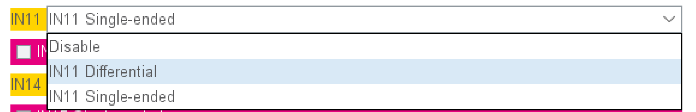

选择单端输入，在下方配置界面：

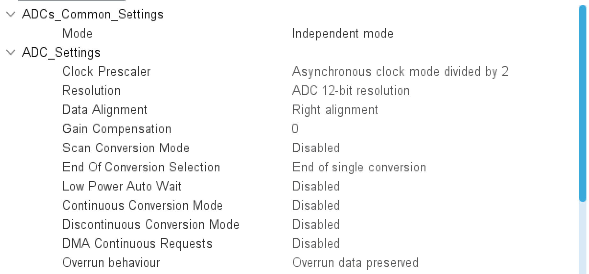

重点是独立模式，异步时钟除2，分辨率改为最高的12bit。


而后是将采样周期选择最大640.5。此时即可生成代码

使用方法：

```c
uint16_t getADC1(void)
{
	uint16_t adc_val;	// 1.定义变量
	HAL_ADC_Start(&hadc1);	// 2.开启ADC
	adc_val = HAL_ADC_GetValue(&hadc1);// 3.获取ADC值
	return adc_val;		// 4.返回ADC值
}
```

​	此函数读取的值并不是单纯的电压值，根据ADC的原理，我们应该将其/4096 再x3.3。

​	在进行这一步时需要注意，要注意浮点数数制的转换。

​	我们可以：

```c
sprintf((char*)LCD_Str,"Val1:%.3f",((((float)getADC1())/4096)*3.3));
LCD_DisplayStringLine(Line2, LCD_Str);
```

​	也可以

```c
sprintf((char*)LCD_Str,"Val1:%.3f",((getADC1()/4096.0)*3.3));
LCD_DisplayStringLine(Line2, LCD_Str);
```

​	错误示例我这里就不放了……也是犯了很多错误，导致最后的数值有问题。

### 4.PWM输出编写

​	不必好奇整理的顺序，这是根据比赛考频整理的，PWM也是经常考察的点，而PWM的输出得借助定时器，我们这里便说说定时器的配置。

#### PWM 产生全过程

以下黑体字去下面的配置图像上认领：

1. **时钟**经过 **PSC** 分频后，推动 **CNT** 向上计数。

2. **CNT** 从 0 开始跑，只要它还没跑到 **CCR** 这个位置，GPIO 引脚就输出高。

3. 一旦 **CNT** 超过了 **CCR**，引脚瞬间变低。

4. 当 **CNT** 最终撞到 **ARR** 终点线时，它瞬间回到 0，引脚重新变回高。

5. 如此往复，一串方波就诞生了。

   ##### 配置

   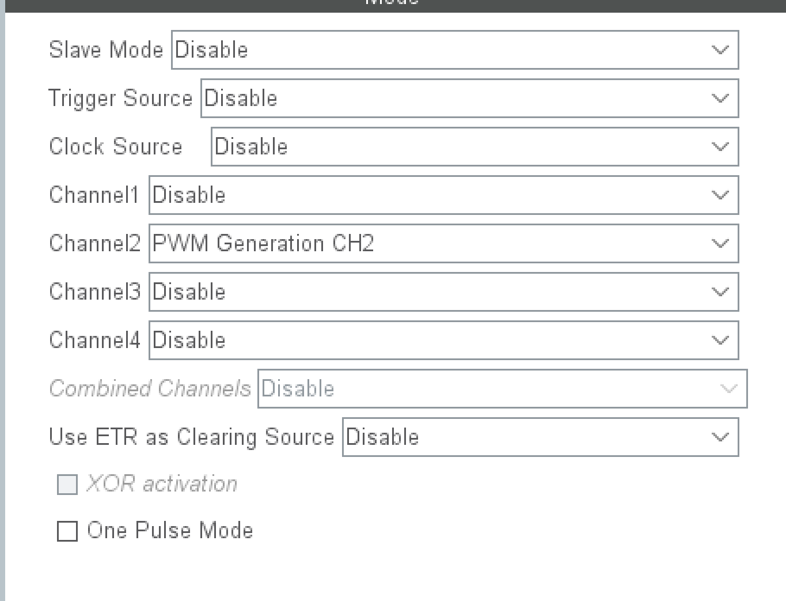

   在Pinout view中，我们只选择一个PWM生成模式，其余先不必去更改。

   这里时钟源的选择默认Display，实际来看和内部时钟没有大的区别。

   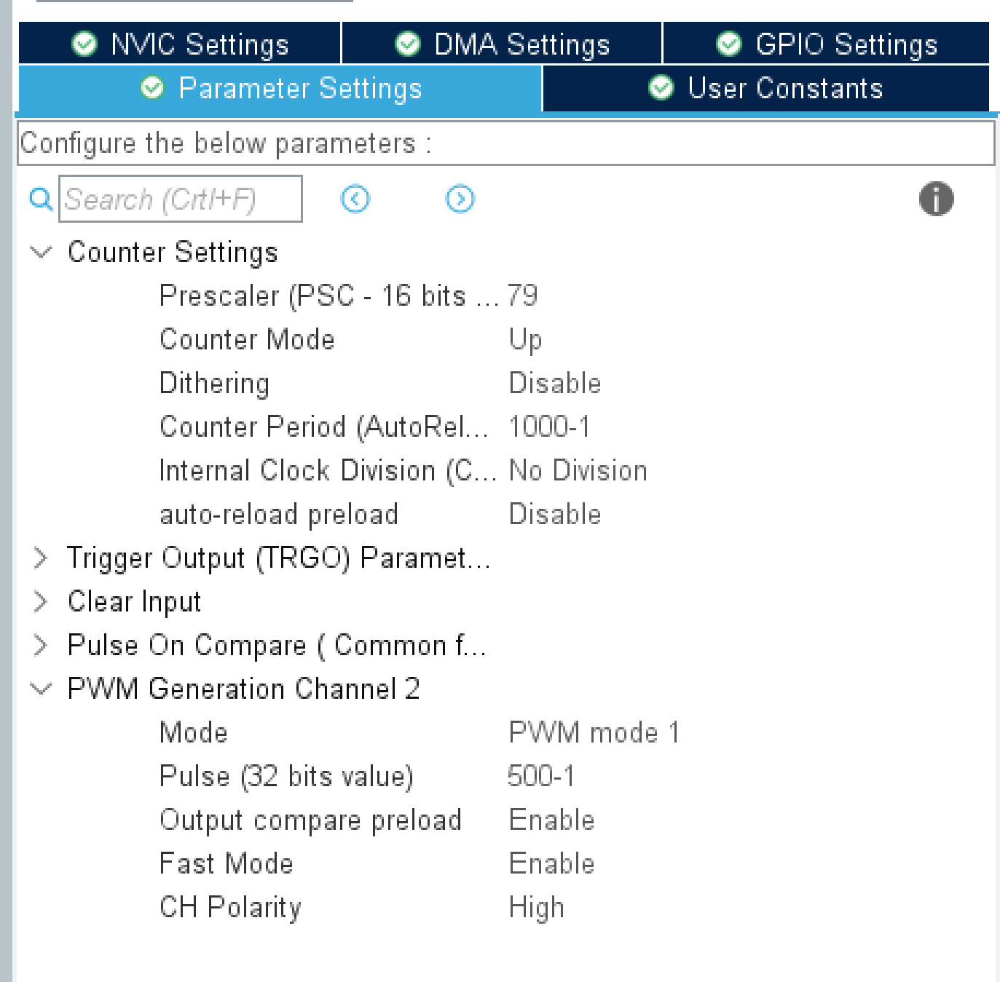

   时钟预分频器设置为 80-1 这样保证我们的定时器产生的脉冲为1mhz，自动重装载寄存器（ARR）和比较寄存器（Pulse）设置参考我们的需求。我们这里的自动重装载寄存器值为1000-1，产生的pwm信号的频率也就是1KHZ，如果是500，产生的频率是2KHZ。

   ##### 频率计算公式 (Frequency)

   频率决定了信号每秒钟跳动多少次。它由 **预分频器 (PSC)** 和 **自动重装载寄存器 (ARR)** 共同决定。

   ​								$$f_{pwm} = \frac{f_{clk}}{(PSC + 1) \times (ARR + 1)}$$

   - **$f_{clk}$**：定时器的输入时钟（单位：$\text{Hz}$）。

   - **$PSC$**：预分频数值。由于从 0 开始计数，实际分频系数是 $PSC + 1$。

   - **$ARR$**：自动重装载值。计数器数到这个数就清零，实际周期长度是 $ARR + 1$。

     因为我们设置了**$PSC$**为**79**（系统主频80-1），故上式可以简化：

     ​								$$f_{pwm} = \frac{1Mhz}{(ARR + 1)}$$

     ##### 占空比计算公式 (Duty Cycle)

     ​	占空比决定了在一个周期内，高电平持续的时间百分比。它由 **比较寄存器 (CCR)** 和 **自动重装载寄存器 (ARR)** 决定。

     ​							$$Duty = \frac{CCR}{ARR + 1} \times 100\%$$

     - **$CCR$**：捕获/比较寄存器的值。
     - **$ARR + 1$**：实际周期长度。

   ​	此时即可生成代码，PWM输出不依赖中断，我们如果想要使PWM成功输出，还有几个简单的步骤。

   ##### PWM操作

   ​	配置并移植完成以后，我们要启动PWM输出：

   ```c
   //启动pwm输出
   HAL_TIM_PWM_Start(&htim,TIM_CHANNEL_1);
   //停止pwm输出
   HAL_TIM_PWM_Stop(&htim,TIM_CHANNEL_1);
   ```

   ​	我们通过操作ARR和Compare值，参考公式，来对PWM方波进行调制。需要用到的HAL库函数为：

   ```c
   //配置PWM频率
   __HAL_TIM_SetAutoreload(&htimn, (uint16_t)pwm_freq_arr);
   //配置PWM占空比    
   __HAL_TIM_SetCompare(&htimn, Channel, (uint16_t)pwm_duty_pulse);
   ```

   ​	这样我们的PWM方波便能够随意调节。这里我们最好**使能自动重装载**，能够使我们的pwm频率实现动态调节。

   ### 5.PWM输入（输入比较）

   ​	首先，我们输入来的PWM信号是从哪来的呢？我们开发板上板载两个方波信号发生器：

   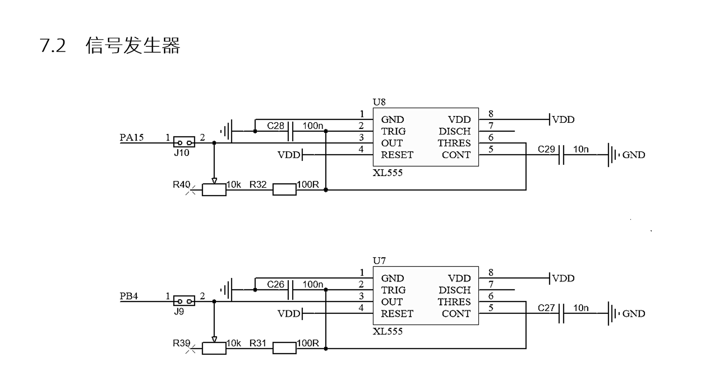

   

   ​	从PA15,PB4输入两路信号，他们分别为TIM8（或者TIM2），TIM3的通道1。

   ##### 配置

   ​	配置上我们以PA15为例：

   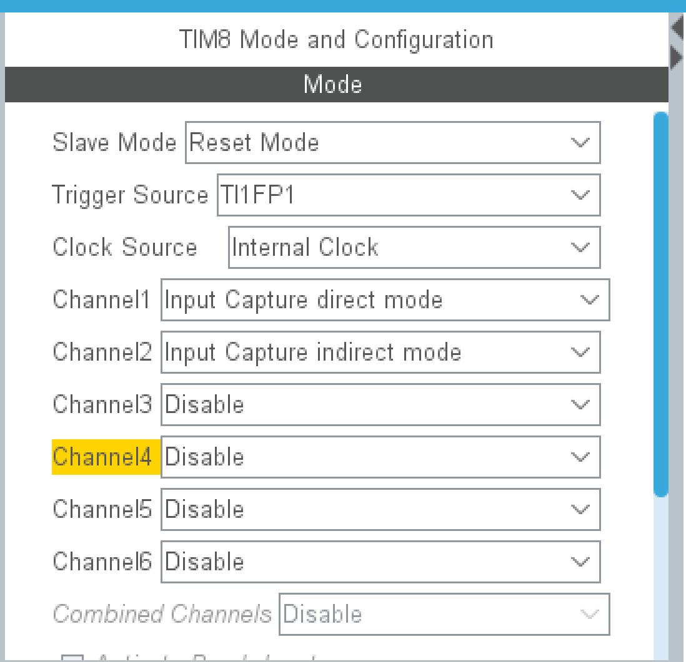

   从模式选择Reset模式（具体原因我还不太明白），边缘选择**TI1FP1**，时钟也选择内部时钟。

   如果输入口是CH2，那就选边缘**TI2FP2**，这点是不同的。

   通道1选择输入捕获直接模式，通道2选择输入捕获间接模式，1选择上升沿，2选择下降沿（**TI1FP1**）。

   分频也是采用79，而自动重装载值给到最大就行。

   同时我们需要开启中断：这里需要注意，TIM8和TIM3中断配置界面不一样

   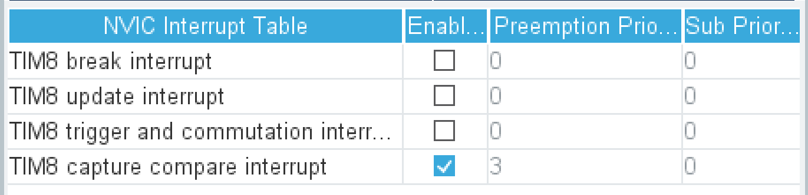

   

   生成的中断代码也是略有不同，心里要有印象。

   还需要在NVIC界面修改中断优先级，将其中断优先级改低，滴答计时器的中断优先级改高。

   ##### 得到频率和占空比

   ​	同pwm输出类似，我们的输入捕获也需要代码打开，**一定不要忘了这一点**：
   
   ```c
   	HAL_TIM_IC_Start_IT(&htim8,TIM_CHANNEL_1);
   	HAL_TIM_IC_Start_IT(&htim8,TIM_CHANNEL_2);
   ```

   ​	如果测量占空比，开启时要打开两个，且以中断形式打开。然后我们需要写一个中断函数，这个中断函数我是背不下来的，但我们可以找到他，在`stm32g4xx_it.c`中，底部会有一个函数：
   
   ```c
   /**
     * @brief This function handles TIM8 capture compare interrupt.
     */
   void TIM8_CC_IRQHandler(void)
   {
     /* USER CODE BEGIN TIM8_CC_IRQn 0 */
   
     /* USER CODE END TIM8_CC_IRQn 0 */
     HAL_TIM_IRQHandler(&htim8);
     /* USER CODE BEGIN TIM8_CC_IRQn 1 */
   
     /* USER CODE END TIM8_CC_IRQn 1 */
   }
   ```
   
   ​	我们对着`HAL_TIM_IRQHandler(&htim8)`F12最终能找到以下函数
   
   ```c
   /**
     * @brief  Input Capture callback in non-blocking mode
     * @param  htim TIM IC handle
     * @retval None
     */
   __weak void HAL_TIM_IC_CaptureCallback(TIM_HandleTypeDef *htim)
   {
     /* Prevent unused argument(s) compilation warning */
     UNUSED(htim);
   
     /* NOTE : This function should not be modified, when the callback is needed,
               the HAL_TIM_IC_CaptureCallback could be implemented in the user file
      */
   }
   ```
   
   ​	如果记不住相应结构体怎么写，我们也可以对着**htim8**一路F12，多少能找到相应的。然后我们将这个弱函数在`main.c`里重新定义：
   
   ```c
      //TIM3和TIM8都是这个中断回调函数，将相关量改为相应定时器即可。
      
      void HAL_TIM_IC_CaptureCallback(TIM_HandleTypeDef *htim)
      {
      	if(htim->Instance == TIM8)	//定时器判别
      	{
      		if(htim->Channel == HAL_TIM_ACTIVE_CHANNEL_1) //通道判别
      		{
               // 周期
      			PWM_Up_Cnt = HAL_TIM_ReadCapturedValue(&htim8,TIM_CHANNEL_1)+1;// 一定+1
      			// 占空比
               Duty = (float)PWM_Down_Cnt/PWM_Up_Cnt;
      		}
      		else if(htim->Channel == HAL_TIM_ACTIVE_CHANNEL_2)	//通道判别
      		{
               // 高电平时间
      			PWM_Down_Cnt = HAL_TIM_ReadCapturedValue(&htim8,TIM_CHANNEL_2)+1;
      		}
      	}
      }
   ```
   
   **含义**：`PWM_Up_Cnt` 记录的是从上一个上升沿到当前上升沿的计数值。这就是**整个周期的长度**。
   
   **占空比计算**：利用上一次的 `PWM_Down_Cnt`除以 `PWM_Up_Cnt`（总周期）。使用了 `(float)` 强制类型转换，确保结果是 0~1 之间的小数。
   
   糊涂了吧，这个流程大体是这样：
   
   **t=0 (上升沿)**：`CNT` 硬件清零，开始跑。
   
   **t=30 (下降沿)**：硬件把 `30` 存入 `CCR2`。触发中断，变量 `PWM_Down_Cnt` 变为 `31`。
   
   **t=100 (下一个上升沿)**：
   
   硬件把 `100` 存入 `CCR1`。硬件把 `CNT` 清零（重新开始）。触发中断，你的变量 `PWM_Up_Cnt` 变为 `101`。**计算**：`Duty = 31 / 101`。计算完成。
   
   
   
   ### 6.串口编写
   
   ​	串口的使用我们仍采用最简单的方式，数据的发送是直接发送，但是接收我们采用中断接收。板载USB转串口，简单来说数据线插在USB1上时就能实现串口通信。（欸？你说USB2咋还没咋用过）我们直接开始配置。
   
   ##### 配置
   
   ​	有关串口的一些知识也是以后补充，这里仍只说配置要点。根据相应资料，我们选择PA9,PA10两引脚作为USART的TX和RX。要先选择，因为默认的端口并不是这俩。选择之后再进行如下配置：
   
   ​	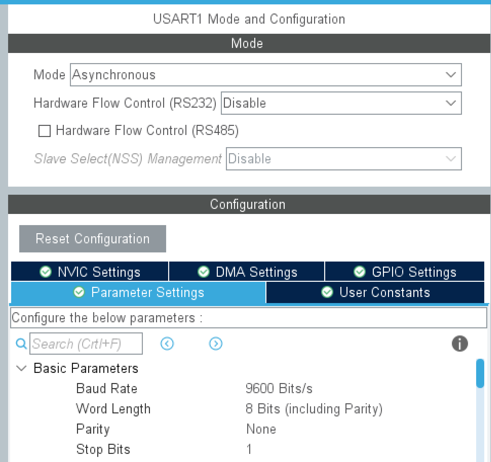
   
   模式选择异步模式，下面的参数我们大多数采用默认，只有波特率可能会改成9600。
   
   如此即可直接生成代码，此时，我们的工程中会生成一个usart.c文件。
   
   ##### 代码编写
   
   串口的发送及其简单：
   
   ```c
   //串口发送函数
   HAL_UART_Transmit(UART_HandleTypeDef *huart, uint8_t *pData, uint16_t Size, uint32_t Timeout);
   //使用案例
   HAL_UART_Transmit(&huart, (uint8_t *)str, len, 100);
   ```
   
   而串口的接收相对复杂，为了不堵塞程序，我们采用中断接收的方式。
   
   ```c
   //在初始化完串口之后，我们需要开启第一次中断
   HAL_UART_Receive_IT(&huart1,Uart_Rx_Str,7);
   ```
   
   ```c
   void HAL_UART_RxCpltCallback(UART_HandleTypeDef *huart)
   {
   	if(huart == &huart1)
   	{
   		HAL_UART_Receive_IT(&huart1,Uart_Rx_Str,7);
   	}
   }
   
   ```
   
   我们编写串口中断回调函数，在每次中断回调之后都再次开启一次接收中断。也可以在此函数中编写对串口接收到的信息进行进一步处理。
   
   ### 7.I2C编写
   
   ​	有一个好消息，我们的I2C驱动代码不用我们手动配置；也有个坏消息，我们需要手写两个外设的I2C通讯。同上，我们这里不详细讲述I2C到底是什么，只是代码的编写。
   
   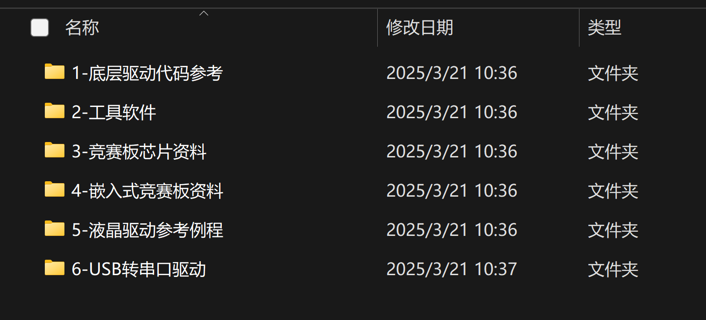
   
   在底层驱动代码中，有我们需要的HAL库驱动代码。我们将其移植到我们的工程中。
   
   ```c
   //驱动代码
   void I2CStart(void);
   void I2CStop(void);
   unsigned char I2CWaitAck(void);
   void I2CSendAck(void);
   void I2CSendNotAck(void);
   void I2CSendByte(unsigned char cSendByte);
   unsigned char I2CReceiveByte(void);
   void I2CInit(void);
   ```
   
   移植就是简单的复制粘贴，移植完成后就是我们的中间层驱动代码的编写，中间层驱动代码如果说要是完全背下来，应该是相对困难的，不过好在也难在我们有手册，可以基于手册去进行记忆。
   
   ##### 24C02
   
   ​	24C02是一个存储器，能实现离电后数据的存储。下面是手册的原文。
   
   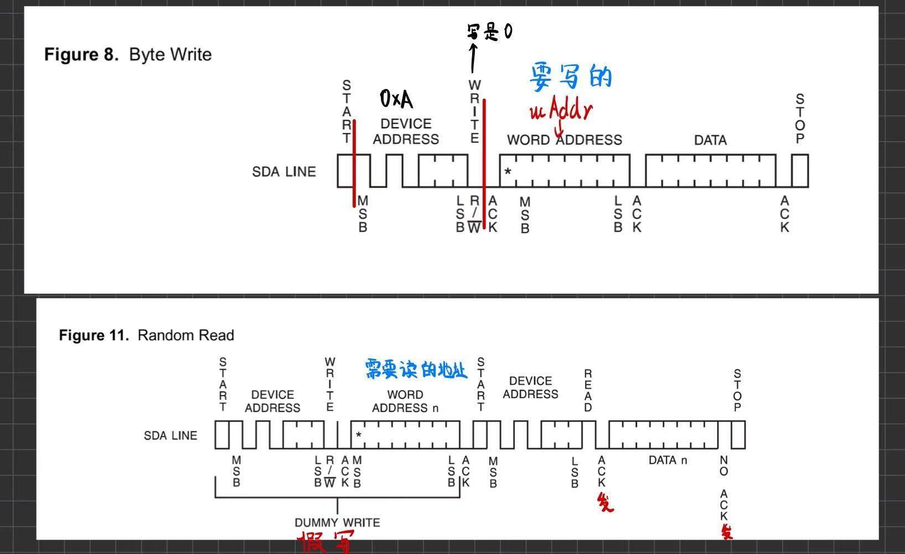
   
   1 ，设备地址有7位（0xAn），但我们看作8位, 最后一位标志着读写 (写为0，读为1，0xA0和0xA1)。
   2 ，设备发数据等芯片应答, 设备收数据给芯片发应答 。
   3 ，读取时假写, 假写时没有停止信号 。
   
   据此，我们可以进行代码的封装。
   
   ```c
   //24C02相关代码
   void iic_24C02_Wirte(uint8_t ucAddr,uint8_t *pucBuf,uint8_t ucNum)
   {
   	I2CStart();
   	I2CSendByte(0xa0);
   	I2CWaitAck();
   	
   	I2CSendByte(ucAddr);
   	I2CWaitAck();
   	
   	while(ucNum--)
   	{
   		I2CSendByte(*pucBuf++);
   		I2CWaitAck();
   	}
   	I2CStop();
   	delay1(500);				//为了保证通讯，我们的写操作需要一定延时
   	
   }
   
   void iic_24C02_Read(uint8_t ucAddr,uint8_t *pucBuf,uint8_t ucNum)
   {
   	I2CStart();
   	I2CSendByte(0xa0);
   	I2CWaitAck();
   	
   	I2CSendByte(ucAddr);
   	I2CWaitAck();
   	
   	I2CStart();
   	I2CSendByte(0xa1);
   	I2CWaitAck();
   	
   	while(ucNum--)
   	{
   		*pucBuf++ = I2CReceiveByte();
   		if(ucNum)
   			I2CSendAck();
   		else
   			I2CSendNotAck();
   	}
   	
   	I2CStop();
   }
   
   ```
   
   这里我们就可以操作24C02去进行写入读取了。
   
   ###### 24C02拓展：对其他类型变量的存储
   
   ​	我们所编写的**iic_24C02_Wirte**，**iic_24C02_Read**函数是基于字节流（一个字节）来进行传输和储存的，所以我们所传输的数据基本都是一字节的（如uint8_t），而例如float变量，其由4个字节组成，我们需要将其转为有4个元素，每个元素为1字节的数组，再进行存诸和读取。
   
   ​	这个功能的实现需要用到C库函数**memcpy()**。
   
   ------
   
   ​	**描述：**C 库函数 **void \*memcpy(void \*str1, const void \*str2, size_t n)** 从存储区 **str2** 复制 **n** 个字节到存储区 **str1**。*改变的是**str1***。
   
   ------
   
   ```c
   uint8_t Save_buffer[4];
   float myFloat = 12.34;
   float ReadFloat;
   uint8_t Read_buffer[4];
   
   /*写入浮点数*/
   memcpy(Save_buffer,&myFloat,sizeof(myFloat));
   iic_24C02_Wirte(0x00,Save_buffer,sizeof(Save_buffer));
   /*读取浮点数*/
   iic_24C02_Read(0x00,Read_buffer,sizeof(Read_buffer));
   memcpy(&ReadFloat,Read_buffer,sizeof(ReadFloat));
   ```
   
   ##### MCP4017
   
   ​	这玩意压根没见用过，但来都来了，搞吧。写入读取相比24C02更加简单。
   
   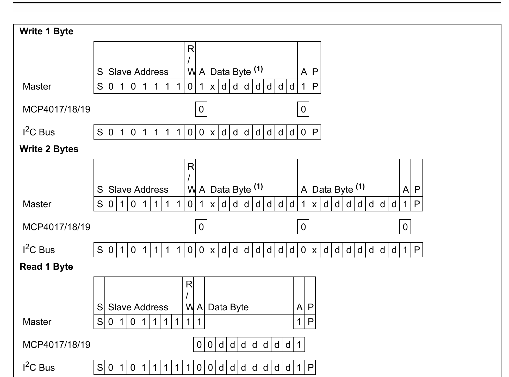
   
   手册上给的并不好看，直接记忆也无妨：
   
   ```c
   //MPC代码
   void Mpc_Wirte(uint8_t pucBuf)
   {
   	
   	I2CStart();
   	I2CSendByte(0x5E);
   	I2CWaitAck();
   	
   	I2CSendByte(pucBuf);
   	I2CWaitAck();
   	I2CStop();
   	
   }
   
   uint8_t Mpc_Read(void)
   {
   	uint8_t val;
   	I2CStart();
   	I2CSendByte(0x5F);
   	I2CWaitAck();
   	
   	val = I2CReceiveByte();
   	I2CSendNotAck();		//同样在读时，发送无应答（实际上无应答这个说法啊……不知道外国人咋想）
   	I2CStop();
   	
   	return val;
   }
   ```
   
   ### 8.RTC时钟
   
   ​	感觉用的不多，简单应用实际上可以用滴答定时器替代。这里还是学一下吧。Mode激活时钟与日历。然后将分频设置为125与6000（相乘等于750KHz），使1s产生一次中断。
   
   
   
   设定时间和日期，按要求设置。
   
   
   
   需要在时钟树界面配置时钟，如下：
   
   
   
   这里就设置了RTC频率为750KHz，故我们对其进行125x6000分频。
   
   **代码：**
   
   ​	通过生成的**rtc.h**，我们可以顺藤摸瓜找到**stm32g4xx_hal_rtc.h**，我们所需的东西都在里面。在里面找到下面两个结构体，在main中定义。
   
   ```C
   RTC_TimeTypeDef rtctime;	// 时间结构体
   RTC_DateTypeDef rtcdate;	// 日期结构体
   ```
   
   ​	可以通过以下函数获取日期和时间：
   
   ```c
   HAL_RTC_GetTime(&hrtc,&rtctime,RTC_FORMAT_BIN);
   HAL_RTC_GetDate(&hrtc,&rtcdate,RTC_FORMAT_BIN);
   ```
   
   这两个函数必须同时使用，不然有bug。
   
   对时间的显示：
   
   ```c
   			sprintf((char *)str,"   %02dH%02dM%02dS   ",rtctime.Hours,rtctime.Minutes,rtctime.Seconds);		// 时 分 秒
   			LCD_DisplayStringLine(Line7, str);
   			sprintf((char *)str,"   %02dY%02dM%02dD%02dW   ",rtcdate.Year,rtcdate.Month,rtcdate.Date,rtcdate.WeekDay);// 年 月 日 星期
   			LCD_DisplayStringLine(Line8, str);
   ```
   
   学习了这个，我们就可以做定时炸弹了（）。
   
   ### 9.外设&逻辑编写思路
   
   考试时间是5个小时，这个时间理论上是充足的，我们整理一下我们的思路。
   
   ​	首先由cubeMX生成源工程代码，这个过程尽量快，尽量不要出错。
   
   ​	外设处理完成之后就是应用层程序的编写，如果此时我们的题目相当复杂，也可以单独封装一个.h.c文件。应用层需要花些心思。但是题目一定是围绕我们的外设相应展开。
   
   ​	一些东西是我们的良好工具：
   
   - 状态机
   
   - 按键读取值(Key_Up,Key_Down)
   
   - uwTick值计时
   
   - sprintf(),memcpy()等C库函数。
   
   - Debug调试器
   
   - 位运算
   
   - 枚举（enum）
   
   #### Bug调试
   
   ​	写的程序基本上会出错，遇到bug不要急，我们有Debug调试器，我们避免成无头苍蝇，更高效的去使用调试器，按一定的顺序和思路去寻找到底是哪里出了问题。
   
   1. 查看外设代码是否正确配置。
   
   2. 从头或从尾开始代码Debug，找出代码从哪个步骤开始出问题的。
   
   3. 相应打断点，运行。
   
   4. 尝试修改。
   
      ### 环境配置
   
      对环境的配置也是比赛的考察范围，比赛的CubeMX版本为6.14.0，目前使用起来问题不大。
   
      25年比赛资料包：
   
      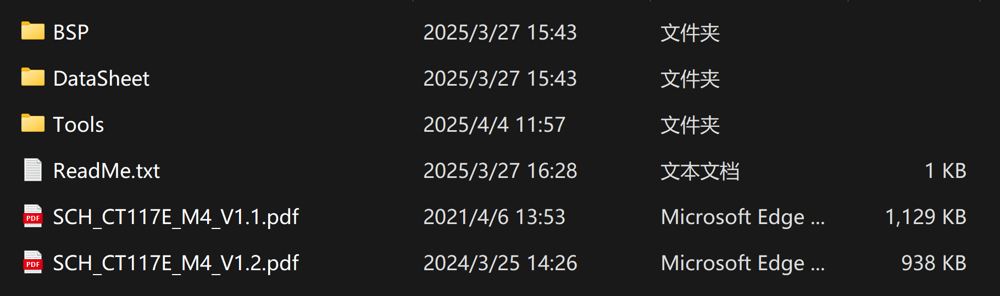
   
      不详细解释，只是Tools里有CudeMX6.14.0安装包，以防万一，**在CudeMX中的Help界面可以安装器件包**。同样给出了keil的器件包，在keil中导入器件包（下图）。
   
      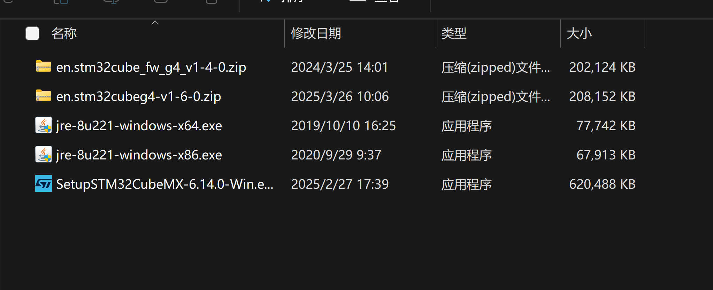
   
      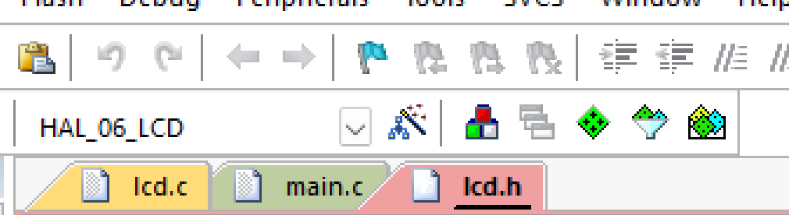
   
      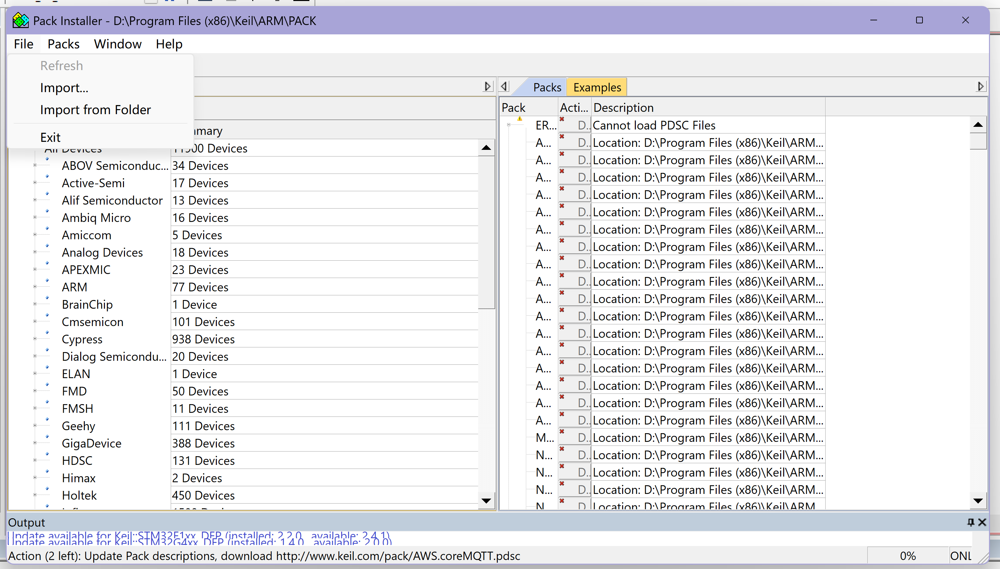

**参考文献**

[C 运算符 | 菜鸟教程](https://www.runoob.com/cprogramming/c-operators.html)

[(83 封私信 / 80 条消息) 介绍一个超级实用的编程思想——状态机 - 知乎](https://zhuanlan.zhihu.com/p/18598358411)

[设计模式：一目了然的状态机图_状态机图怎么画-CSDN博客](https://blog.csdn.net/xinghuanmeiying/article/details/81586954?utm_medium=distribute.pc_relevant.none-task-blog-BlogCommendFromMachineLearnPai2-1.add_param_isCf&depth_1-utm_source=distribute.pc_relevant.none-task-blog-BlogCommendFromMachineLearnPai2-1.add_param_isCf)
