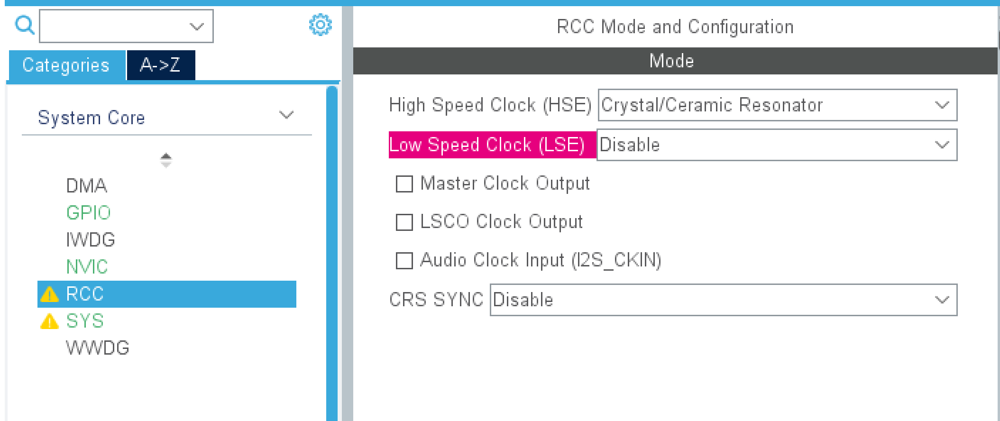
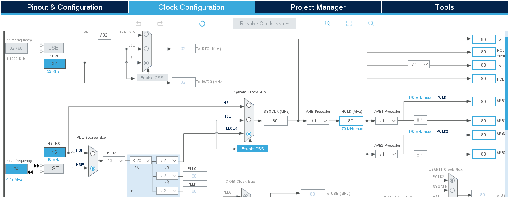
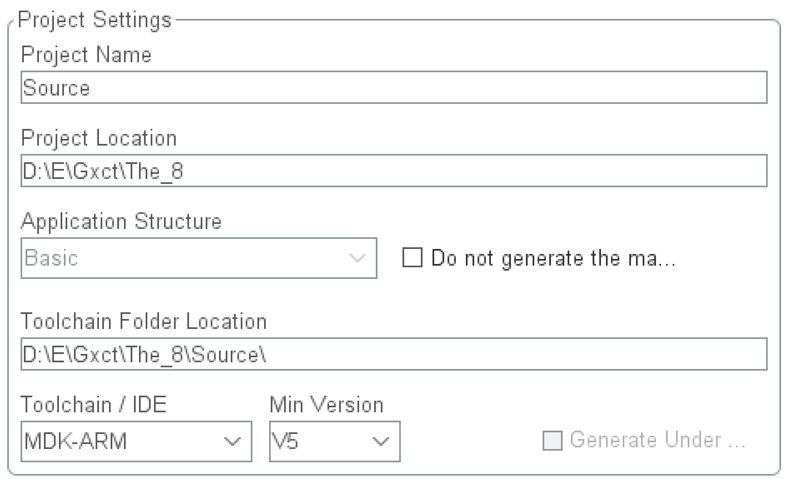
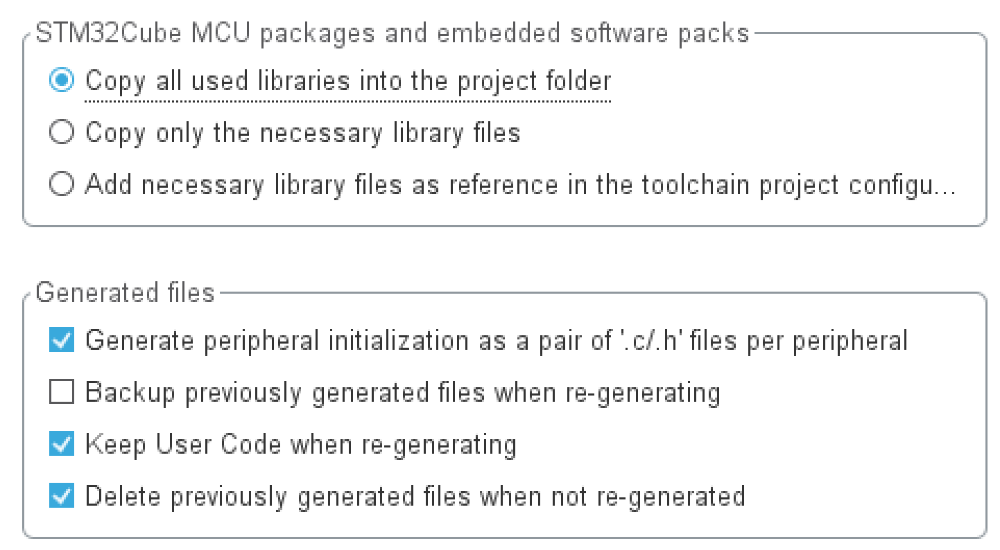
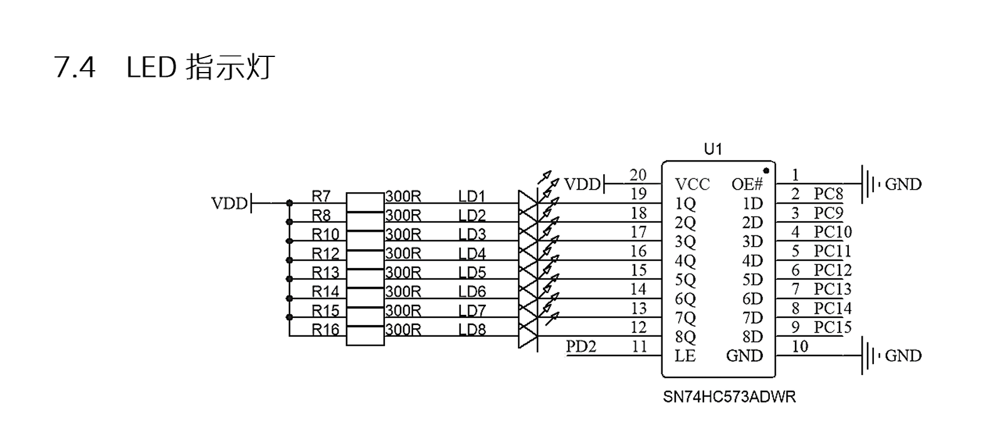
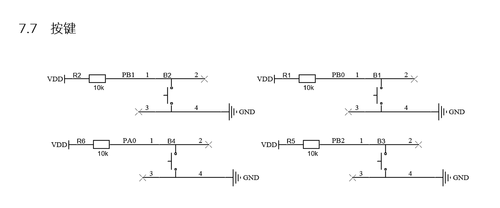

# 蓝桥杯备赛日志

[TOC]


## 零、前置知识

​	基础不牢，地动山摇。这里简单补充一下一些可能需要的前置知识。

### 1、运算

#### 算术运算符

​	很简单，不叨扰。

| 运输符 |           运算           |
| :----: | :----------------------: |
|   +    |            加            |
|   -    |            减            |
|   *    |            乘            |
|   /    |            除            |
|   %    | 取模运算符，整除后的余数 |
|   ++   | 自增运算符，整数值增加 1 |
|   --   | 自减运算符，整数值减少 1 |

​	务必熟记他们的作用（尤其是自增自减），在一些数学处理中会有很大作用。

#### 关系运算符

假设变量 **A** 的值为 10，变量 **B** 的值为 20，则：

|运算符  |描述 |实例|
| ---- | ------------------------------------------------------------ | --------------- |
| ==   | 检查两个操作数的值是否相等，如果相等则条件为真。             | (A == B) 为假。 |
| !=   | 检查两个操作数的值是否相等，如果不相等则条件为真。           | (A != B) 为真。 |
| >    | 检查左操作数的值是否大于右操作数的值，如果是则条件为真。     | (A > B) 为假。  |
| <    | 检查左操作数的值是否小于右操作数的值，如果是则条件为真。     | (A < B) 为真。  |
| >=   | 检查左操作数的值是否大于或等于右操作数的值，如果是则条件为真。 | (A >= B) 为假。 |
| <=   | 检查左操作数的值是否小于或等于右操作数的值，如果是则条件为真。 | (A <= B) 为真。 |

​	主要运用在条件判断中。

#### 逻辑运算符

假设变量 **A** 的值为 1，变量 **B** 的值为 0，则：

| 运算符 | 描述                                                         | 实例              |
| :----- | :----------------------------------------------------------- | :---------------- |
| &&     | 称为逻辑与运算符。如果两个操作数都非零，则条件为真。         | (A && B) 为假。   |
| \|\|   | 称为逻辑或运算符。如果两个操作数中有任意一个非零，则条件为真。 | (A \|\| B) 为真。 |
| !      | 称为逻辑非运算符。用来逆转操作数的逻辑状态。如果条件为真则逻辑非运算符将使其为假。 | !(A && B) 为真。  |

​	当下很多人学的第一门编程语言是Python，这三者在Python中便是**and**，**or**，**not**。也多用于条件判断。

#### 位运算符

​	位运算符作用于位，并逐位执行操作。&、 | 和 ^ 的真值表如下所示：

| p    | q    | p & q | p \| q | p ^ q |
| :--- | :--- | :---- | :----- | :---- |
| 0    | 0    | 0     | 0      | 0     |
| 0    | 1    | 0     | 1      | 1     |
| 1    | 1    | 1     | 1      | 0     |
| 1    | 0    | 0     | 1      | 1     |

​	**&与，只有二者都为1时才得1；|或，二者只要有1，就得1；^异或，二者不同得1，相同得0。**

假设如果 A = 60，且 B = 13，现在以二进制格式表示，它们如下所示：

A = 0011 1100

B = 0000 1101

\-----------------

A&B = 0000 1100

A|B = 0011 1101

A^B = 0011 0001

~A = 1100 0011

假设变量 **A** 的值为 60，变量 **B** 的值为 13，则：

| 运算符 | 描述                                                         | 实例                                                         |
| :----- | :----------------------------------------------------------- | :----------------------------------------------------------- |
| &      | 对两个操作数的每一位执行逻辑与操作，如果两个相应的位都为 1，则结果为 1，否则为 0。按位与操作，按二进制位进行"与"运算。运算规则：`0&0=0;    0&1=0;     1&0=0;      1&1=1;` | (A & B) 将得到 12，即为 0000 1100                            |
| \|     | 对两个操作数的每一位执行逻辑或操作，如果两个相应的位都为 0，则结果为 0，否则为 1。按位或运算符，按二进制位进行"或"运算。运算规则：`0|0=0;    0|1=1;    1|0=1;     1|1=1;` | (A \| B) 将得到 61，即为 0011 1101                           |
| ^      | 对两个操作数的每一位执行逻辑异或操作，如果两个相应的位值相同，则结果为 0，否则为 1。异或运算符，按二进制位进行"异或"运算。运算规则：`0^0=0;    0^1=1;    1^0=1;   1^1=0;` | (A ^ B) 将得到 49，即为 0011 0001                            |
| ~      | 对操作数的每一位执行逻辑取反操作，即将每一位的 0 变为 1，1 变为 0。取反运算符，按二进制位进行"取反"运算。运算规则：`~1=-2;    ~0=-1;` | (~A ) 将得到 -61，即为 1100 0011，一个有符号二进制数的补码形式。 |
| <<     | 将操作数的所有位向左移动指定的位数。左移 n 位相当于乘以 2 的 n 次方。二进制左移运算符。将一个运算对象的各二进制位全部左移若干位（左边的二进制位丢弃，右边补0）。 | A << 2 将得到 240，即为 1111 0000                            |
| >>     | 将操作数的所有位向右移动指定的位数。右移n位相当于除以 2 的 n 次方。二进制右移运算符。将一个数的各二进制位全部右移若干位，正数左补 0，负数左补 1，右边丢弃。 | A >> 2 将得到 15，即为 0000 1111                             |

#### 赋值运算符

| 运算符 | 描述                                                         | 实例                            |
| :----- | :----------------------------------------------------------- | :------------------------------ |
| =      | 简单的赋值运算符，把右边操作数的值赋给左边操作数             | C = A + B 将把 A + B 的值赋给 C |
| +=     | 加且赋值运算符，把右边操作数加上左边操作数的结果赋值给左边操作数 | C += A 相当于 C = C + A         |
| -=     | 减且赋值运算符，把左边操作数减去右边操作数的结果赋值给左边操作数 | C -= A 相当于 C = C - A         |
| *=     | 乘且赋值运算符，把右边操作数乘以左边操作数的结果赋值给左边操作数 | C *= A 相当于 C = C * A         |
| /=     | 除且赋值运算符，把左边操作数除以右边操作数的结果赋值给左边操作数 | C /= A 相当于 C = C / A         |
| %=     | 求模且赋值运算符，求两个操作数的模赋值给左边操作数           | C %= A 相当于 C = C % A         |
| <<=    | 左移且赋值运算符                                             | C <<= 2 等同于 C = C << 2       |
| >>=    | 右移且赋值运算符                                             | C >>= 2 等同于 C = C >> 2       |
| &=     | 按位与且赋值运算符                                           | C &= 2 等同于 C = C & 2         |
| ^=     | 按位异或且赋值运算符                                         | C ^= 2 等同于 C = C ^ 2         |
| \|=    | 按位或且赋值运算符                                           | C \|= 2 等同于 C = C \| 2       |

### 2、状态机

​	状态机是一种将复杂逻辑可视化和结构化的思维模型。它通过**状态**、**事件**和**转移**这三个核心要素，清晰地定义了事物的行为规则。在处理任何包含明确阶段和规则的生命周期问题时，状态机都是一个非常值得考虑的解决方案。

​	

​	LCD显示屏在切换界面时，常使用状态机来管理不同的显示内容。下面以一个简单的例子说明：假设我们需要显示两个界面（界面1和界面2），通过一个状态变量来控制当前显示哪个界面。

首先，定义一个枚举类型来表示所有可能的界面状态：

```c
typedef enum {
    SCREEN_1,   // 界面1
    SCREEN_2    // 界面2
} ScreenState;

ScreenState State = SCREEN_1;  // 初始状态为界面1
```

循环中，根据当前状态调用对应的显示函数，并检测按键按下来改变状态：

```c
while (1) {
    switch (State) {
        case SCREEN_1:
            displayScreen1();   // 显示界面1的内容
            if (keydown()) {  // 检测到切换按键
                currentState = SCREEN_2;  // 切换到界面2
            }
            break;
        case SCREEN_2:
            displayScreen2();   // 显示界面2的内容
            if (keydown()) {
                currentState = SCREEN_1;  // 切换回界面1
            }
            break;
    }
}
```

## 一，主观题

### 引言：

​	不由的说，这是第二次踏上备赛历程，一年了，很多变化也不由让人感叹，仍然屁话不多说了，干吧。

​																			2026年2月19日 日子人

### 0.总说

​	本文档基于蚂蚁工厂的蓝桥杯嵌入式课程整理，其大致思路为（CodeMx只作为配置工具，将其生成的代码细化拆分再合并为新工程），孰优孰劣，还很难说。如今在此基础上进行一定的改良，争取缩短硬件配置的时间。

​	本文档的主要目的是记录一些代码思路和配置信息，比赛确是学习的好方式，期间也多有收获，仅此作为记录。

### 1.最初工程的建立（系统时钟和其他配置）

​	我们最初的模板是基于CobeMX生成的Source工程，然后以Source为源文件打底，复制生成新工程Project，再用CodeMX不断生成配置代码到Source中，再从Source中复制我们需要的代码到Project，最终以Project为最终作品。

​	首先是时钟，我们高速时钟选择外部晶振，这个步骤会使我们使能我们的GPIOF。



​	外部晶振的大小是24MHZ，记住这一点。我们需要在时钟树界面配置使系统主频达到80MHZ。



​	选择外部时钟，24MHZ，3分配 *20 /2，选择锁相环控制，得到系统主频80MHZ。也可以选择外部时钟，锁相环控制后，直接输入80MHZ，软件会自己计算分配数值。

​	然后更改Project Mananger界面，打开Project侧栏。只更改Project Settings。文件路径建议全英文，这样不容易出问题。



而在Code Generator中我们选定生成独立的.c.h文件。



​	此时，我们的工程文档的基础已经打好，下面就可以开始进行我们外设的配置。与上次不同，这一次我们直接在生成的文档里进行编写。

### 2.三大金刚——LED KEY LCD外设

​	LED KEY LCD这三兄弟是比赛必出，我们把他们放到一起说。有关GPIO的底层原理我们这里不再赘述。这里讲一下配置的要点和代码的思路。

#### ①LED

​	简单看一下操作原理。



​	GPIO口与LED小灯的连接经过一个**锁存器**，锁存器由PD2所控制，PD2输出高电平时，PC8-15才能去控制LED，而PD2输出低电平时，我们的小灯会在原来的状态被锁住……亮的保持亮，暗的继续暗。

​	小灯的一端是高电平，故我们将**GPIO置低**小灯会亮。而且我们一开始希望灯是灭的，那么我们的PD应该为LOW，而PC应该为HIGH，速度为LOW就可以。都选择推挽输出模式。这样就在gpio.c里面生成了**void MX_GPIO_Init(void)。**

我们在gpio.c中后面的代码注释中间加入：

```c
void Led_Disp(uint8_t ucLed)
{
	//开始保证小灯熄灭
	HAL_GPIO_WritePin(GPIOC, GPIO_PIN_13|GPIO_PIN_14|GPIO_PIN_15|GPIO_PIN_8
                          |GPIO_PIN_9|GPIO_PIN_10|GPIO_PIN_11|GPIO_PIN_12, GPIO_PIN_SET);
	HAL_GPIO_WritePin(GPIOD,GPIO_PIN_2,GPIO_PIN_SET);
	HAL_GPIO_WritePin(GPIOD,GPIO_PIN_2,GPIO_PIN_RESET);
	
	HAL_GPIO_WritePin(GPIOC,ucLed<<8, GPIO_PIN_RESET);
	HAL_GPIO_WritePin(GPIOD,GPIO_PIN_2,GPIO_PIN_SET);
	HAL_GPIO_WritePin(GPIOD,GPIO_PIN_2,GPIO_PIN_RESET);

}
```

对GPIOC进行统一操作，通过ucLed变量点亮 PC8到PC15，左移八位是因为原变量为uint16_t（0x0000）类型，uint8_t（0x00）左移8为与其GPIO对应。而对PD2的操作相当于对锁存器的激活。16进制转2进制的知识我们在此不再赘述。

#### ②KEY



​	按键需要注意，当按键按下时，我们的GPIO**读取的电平为低电平**；没有被按下时，我们的电平为高电平。配置上，输入模式（一定注意，不要在和LED一起配置时将其配置为输出）。外部是配置了高电平的，我们不用对其上下拉，浮空即可。

​	我们对键值的扫描读取方式是：

```c
uint8_t Key_Scan(void)
{
	uint8_t Key_Val = 0;
	if (HAL_GPIO_ReadPin(GPIOB,GPIO_PIN_0) == GPIO_PIN_RESET)
		Key_Val = 1;
	if (HAL_GPIO_ReadPin(GPIOB,GPIO_PIN_1) == GPIO_PIN_RESET)
		Key_Val = 2;
	if (HAL_GPIO_ReadPin(GPIOB,GPIO_PIN_2) == GPIO_PIN_RESET)
		Key_Val = 3;
	if (HAL_GPIO_ReadPin(GPIOA,GPIO_PIN_0) == GPIO_PIN_RESET)
		Key_Val = 4;
	return Key_Val;
}
```

而对按键进行处理的程序为：

```c
void Key_Proc(void)
{
	if((uwTick - Key_uwTick_Set) <= Key_Peroid)
		return;
	Key_uwTick_Set = uwTick;
	

	Key_Val = Key_Scan();
	Key_Down = Key_Val & (Key_Val ^ Old_Key_Val);
	Key_Up = ~Key_Val & (Key_Val ^ Old_Key_Val);
	Old_Key_Val = Key_Val;

	if (Key_Down == 1)
		Key_Proc1();
	else if(Key_Down == 2)
		Key_Proc2();
	else if(Key_Down == 3)
		Key_Proc3();
	else if(Key_Down == 4)
		Key_Proc4();

}
```

这个相当于是一个固定程序，我们对按键的功能封装在了独立的Key_Proc’N‘()中，这段代码我非常喜欢，有两个要紧的点。

```c
//定时程序
if((uwTick - Key_uwTick_Set) <= Key_Peroid)
	return;
Key_uwTick_Set = uwTick;
```

​	我们的Key_Proc函数会被放在主循环中，为了实现“多线程”，设计了这样的一个分频程序。uwTick是配合系统滴答定时器（SysTick）的一个全局变量，每过1ms增加一次，类型为 **__IO uint32_t**。我们再定义一个同类型的变量（如Key_uwTick_Set）作为打点，在主循环中不断比较uwTick与Key_uwTick_Set的大小，小于我们规定的周期便跳出程序，大于便重新打点并执行下面的程序。

​	此处要注意，因为运算符有优先级，我们需要用括号将先进行计算的括起来。

​	然后就是键值处理：

```c
Key_Val = Key_Scan();
Key_Down = Key_Val & (Key_Val ^ Old_Key_Val);
Key_Up = ~Key_Val & (Key_Val ^ Old_Key_Val);
Old_Key_Val = Key_Val;
```

​	不得不说位运算经常是个好的思路，这种键值处理的方式也相当好用且优雅。**Key_Scan();**函数我们上文有提及，他将返回一个被按下的键值。先看**Key_Down = Key_Val & (Key_Val ^ Old_Key_Val);** 为什么按键按下的值就是这玩意呢，方便讲述和理解，我们就假设只有一个按钮，按下为1，松开为0。那么**(Key_Val ^ Old_Key_Val)**异或的作用就是检测键值是否发生变化，变化为1，不变为0。**Key_Val & (Key_Val ^ Old_Key_Val)**那么这一段含义便是，如果键值变化 **Key_Val & 1** 就是按下的键值，**~Key_Val & 1**就是松开的键值。如果不懂不妨代入数值自己写写，会发现这很巧妙，即使把**Key_Val**键值换成 2 (0x02) 3 (0x03) 4 (0x04)，结果也是一样的。

​	如此我们便得到了两个巧妙的工具，**Key_Down**和**Key_Up**，这会有妙用。

##### 按键扩展

长按短按：（自己瞎写的，还没试）

```c
void Key_Proc(void)
{
    //扫描和读取……
    
	if(Key_Down)
    	Set_Tick = Tick;
	if(Key_Up)
	{
    	if(Tick - Set_Tick >= Peroid)
    	{
        //在此编写长按程序
    	}
    	else
    	{
        //在此编写短按程序
    	}
    
	}
}
```

程序应该对，在Key_Peroid小的情况下，Key_Proc()里的减速分频对其没有太大影响。

无操作1秒钟后切换状态：

```c
void Lift_Proc(void)
{
	switch(ucState)
	{
		case LT_STOP:
			if(Key_Up)
			{
				Lift_uwTick_Set = uwTick;
				ucState = LT_WAIT_KEY;
			}
			break;
		case LT_WAIT_KEY:
			if((uwTick - Lift_uwTick_Set) >= Lift_Peroid)
			{
				if(Lift_Enable){
					if(Lift_Enable & Floot_Sta)
					{
						Lift_Enable = Lift_Enable &(~(Lift_Enable & Floot_Sta));
						break;
					}
					if(Lift_Enable > Floot_Sta)
						ucState = LT_UP;
					else if(Lift_Enable < Floot_Sta)
						ucState = LT_DOWN;
				}
				else ucState = LT_STOP;
			}
			else
			{
				if(Key_Down) ucState = LT_STOP;
			}
			break;
		case LT_UP:
			Lift_Up();
			Floot_Sta = Floot_Sta << 1;
			ucState = LT_CON;
			break;
		case LT_DOWN:
			Lift_Down();
			Floot_Sta = Floot_Sta >> 1;
			ucState = LT_CON;
			break;
		case LT_CON:
			if(Lift_Enable & Floot_Sta) //0110 & 0010  = 0010
			{
				Lift_Enable = Lift_Enable &(~(Lift_Enable & Floot_Sta));
				Lift_Open();
				Lift_Clos();
			}
			ucState = LT_WAIT_KEY;
	}
}
```

​	这是蓝桥杯第8届省赛，其中有个一秒钟电梯按钮没有被点击电梯启动。只是放在这里，不多说了。

#### ③LCD

​	LCD的程序在真实比赛中配置相对简单，因为比赛资料会给出我们的LCD驱动程序，我们要写的只有显示逻辑。在显示上需要用到**sprintf()**函数，这个函数的使用方式我经常忘记。

```c
sprintf((char *)Lcd_str ,"    data:%d",data);
LCD_DisplayStringLine(Line1,Lcd_str);
```

此代码组合可以实现对变量的显示。我们同样把LCD显示的任务放到一个与按钮类似的分频程序中，用于动态显示我们需要显示的量。

```c
void Lcd_Proc(void)
{
	if((uwTick - Lcd_uwTick_Set) < Lcd_Peroid)
		return;
	Lcd_uwTick_Set = uwTick;
	
    //数据显示逻辑
    sprintf((char *)Lcd_str ,"    data:%d",data);
	LCD_DisplayStringLine(Line1,Lcd_str);
    
}

```

​	简单做了个动画演示，箭头代表程序运行进程。


实现具体功能多参考官方给出的示例代码，我还其中发现其中还有不少好玩的东西。以后有空可以试试。

**参考文献**

[C 运算符 | 菜鸟教程](https://www.runoob.com/cprogramming/c-operators.html)

[(83 封私信 / 80 条消息) 介绍一个超级实用的编程思想——状态机 - 知乎](https://zhuanlan.zhihu.com/p/18598358411)

[设计模式：一目了然的状态机图_状态机图怎么画-CSDN博客](https://blog.csdn.net/xinghuanmeiying/article/details/81586954?utm_medium=distribute.pc_relevant.none-task-blog-BlogCommendFromMachineLearnPai2-1.add_param_isCf&depth_1-utm_source=distribute.pc_relevant.none-task-blog-BlogCommendFromMachineLearnPai2-1.add_param_isCf)
